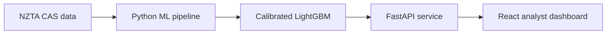

<p align="center">
  
</p>

<h1 align="center">Arotahi</h1>

<p align="center">
  <strong>NZ Crash Area Prioritiser</strong><br />
  Turning historical crash data into a practical, capacity-aware review queue for road-safety analysts.
</p>

<p align="center">
  <a href="https://www.ademartutor.com/">Website</a> ·
  <a href="https://www.linkedin.com/in/ademar-tutor-0a95972a">LinkedIn</a> ·
  <a href="https://github.com/iamademar">GitHub</a>
</p>

<p align="center">
  <sub>Live demo: coming soon · Video walkthrough: coming soon</sub>
</p>

## Overview

Arotahi is an end-to-end machine-learning application that helps road-safety analysts decide which recurring crash areas to review first.

The system divides New Zealand into fixed 1 km grid cells, uses each cell's previous five years of crash history, and estimates the probability that it will record at least one serious or fatal crash in the target year. Analysts select a region and set how many areas they can realistically review. Arotahi then presents that many areas from the top of the ranking on an interactive map and in a review queue.

I built the complete workflow: data audit, geospatial feature engineering, temporal model evaluation, calibrated prediction service, typed React interface, and product safeguards designed for responsible use.

> Arotahi means “to focus” or “look steadily”. The name reflects the product's purpose: directing limited analyst attention towards a manageable set of areas for closer review.

## Why this project matters

Road-safety teams cannot inspect every location at once. Arotahi turns a model score into a concrete operational question:

> If an analyst can review only 50 areas, which 50 should they examine first?

The application supports that decision without presenting the model as an engineering recommendation. It identifies where to look, not what intervention to build.

## Results

The recommended model is a calibrated LightGBM classifier. It was selected using expanding-window validation and evaluated on two locked test years that were never used for fitting or calibration.

| Evaluation | Calibrated model | Strongest non-ML baseline | Difference |
|---|---:|---:|---:|
| Mean within-region Recall@5%, 2024 | **26.2%** | 21.9% | **+4.3 pp** |
| Mean within-region Recall@5%, 2025 | **27.9%** | 19.3% | **+8.7 pp** |
| National Recall@5%, 2024 | **31.7%** | 27.6% | **+4.2 pp** |
| Brier score, 2024 | **0.059** | n/a | Calibrated probability |

The performance improvement over the strongest baseline remained positive across 1,000 paired bootstrap resamples in both locked years. Isotonic calibration reduced the 2024 Brier score from 0.157 to 0.059 while preserving the ranking.

The primary metric measures how many eligible serious or fatal crash cells are captured when each region reviews its highest-ranked 5% of cells. This directly reflects the product's capacity-limited use case.

## Product features

- **Capacity-aware prioritisation:** choose a region and review capacity, then receive a ranked queue sized to the analyst's workload.
- **Interactive national map:** render more than 21,000 NZTM grid cells with MapLibre, with no map API key or paid tile service required.
- **Historical backtesting:** switch between 2024 and 2025 and optionally reveal actual outcomes after reviewing the model's ranking.
- **Area detail view:** inspect prior crash counts, serious or fatal crash history, ranking, percentile, eligibility, and model provenance.
- **Analyst shortlist:** save areas without conflating the model's recommendation with the analyst's final decision.
- **Exportable review brief:** retain the score and model version that were active when an area was selected.
- **Model transparency:** explore the data pipeline, published evaluation, model card, and searchable feature dictionary inside the application.
- **Accessible interaction:** keyboard-accessible table alternative, labelled controls, reduced-motion support, visible focus states, and no colour-only risk encoding.

## End-to-end architecture



The pipeline audits **705,609 crash records across 72 fields**, assigns each crash to a 1 km NZTM grid cell, constructs leakage-safe one-, three-, and five-year features, and ranks eligible areas using a calibrated model. The API serves scores, history, feature metadata, model documentation, and provenance to the front end.

## Engineering and ML decisions

### Evaluation that matches the real decision

Random train/test splits would allow future patterns to leak into model development. Arotahi instead trains on earlier years, tunes with expanding-window folds, validates on 2023, and keeps 2024 and 2025 locked for final backtesting.

The model is evaluated with Recall@K, Precision@K, Lift@K, PR-AUC, Brier score, regional breakdowns, capacity ceilings, and paired bootstrap intervals. Recall@K is the primary measure because the product exists to rank a limited review list.

### Calibrated probabilities, fine-grained ranking

The interface reports isotonic-calibrated probabilities so that a displayed probability has an interpretable meaning. Ranking uses the underlying uncalibrated score because calibration creates ties; this preserves a stable ordering for capacity cut-offs while keeping the displayed probabilities honest.

### “Not assessed” is not “low risk”

Only cells with at least one recorded crash in the previous five years are eligible. An ineligible cell is returned as **not scored**, never as a low probability. This distinction matters because roughly one in seven cells that later recorded a serious or fatal crash had no recent history and could not be assessed by this model.

### Reproducibility and contract safety

- Every score includes model, grid, feature-schema, and source-snapshot versions.
- Leakage tests verify that target-year records cannot enter the feature set.
- API parity tests compare served probabilities with frozen backtest scores.
- Zod validates every API response at the front-end boundary.
- Model dependencies are pinned to prevent silent prediction drift when loading saved estimators.

## Technology stack

| Layer | Technologies |
|---|---|
| Front end | React, TypeScript, Vite, TanStack Query, React Router, MapLibre GL, Motion, Zod |
| Machine learning | Python, pandas, NumPy, scikit-learn, LightGBM, SHAP, Apache Parquet, Jupyter |
| API | FastAPI, Pydantic, Uvicorn |
| Testing | pytest, Vitest, Testing Library |
| Geospatial | NZTM / EPSG:2193, proj4, GeoJSON |

## Quick setup

### Prerequisites

- Python 3.11
- Node.js 20 or later
- The public [NZTA Crash Analysis System dataset](https://opendata-nzta.opendata.arcgis.com/datasets/NZTA::crash-analysis-system-cas-data-1/about)

The source CSV is intentionally excluded from Git. Save the downloaded file as:

```text
ml/data/raw/Crash_Analysis_System__CAS__data.csv.csv
```

### 1. Build and test the ML pipeline

```bash
cd ml
python3.11 -m venv .venv
source .venv/bin/activate
pip install -r requirements.txt
python -m pytest tests -q

cd notebooks
jupyter nbconvert --to notebook --execute --inplace 01_eda.ipynb
jupyter nbconvert --to notebook --execute --inplace 02_modelling_leaderboard.ipynb
```

Run the EDA notebook first because it creates the panel used by the modelling notebook.

### 2. Start the prediction API

From the repository root:

```bash
cd prediction-api
python3.11 -m venv .venv
source .venv/bin/activate
pip install -r requirements.txt
python scripts/export_serving_data.py
python scripts/train_and_save.py
uvicorn app.main:app --reload
```

The API runs at `http://127.0.0.1:8000`; interactive documentation is available at `http://127.0.0.1:8000/docs`.

### 3. Start the web application

In a second terminal, from the repository root:

```bash
cd frontend
npm install
npm run dev
```

Open `http://localhost:5173`. No map API key or client-side environment variables are required. To use an API at a different address, start Vite with `VITE_API_TARGET` set to that URL.

## Tests

```bash
# ML pipeline
cd ml && .venv/bin/python -m pytest tests -q

# Prediction service
cd prediction-api && .venv/bin/python -m pytest tests -q

# Front end
cd frontend && npm test && npm run build
```

The test suite covers grid assignment, temporal leakage, ranking metrics, model persistence, API response behaviour, shortlist integrity, outcome hiding, and user-interface rendering.

## Repository structure

```text
frontend/         React and TypeScript analyst dashboard
prediction-api/   Standalone FastAPI scoring service
ml/               Data audit, feature engineering, notebooks, models, and evaluation
design-system/    NZ civic-transport visual direction and prototype
template/         Early product prototype
```

More detailed implementation notes are available in [`ml/README.md`](ml/README.md), [`prediction-api/README.md`](prediction-api/README.md), and [`frontend/README.md`](frontend/README.md).

## Data source

The project uses the public [Crash Analysis System (CAS) dataset](https://opendata-nzta.opendata.arcgis.com/datasets/NZTA::crash-analysis-system-cas-data-1/about) from NZ Transport Agency Waka Kotahi. Field definitions are available in the [CAS data documentation](https://opendata-nzta.opendata.arcgis.com/pages/cas-data-field-descriptions).

## Scope and limitations

Arotahi is a research and portfolio project, not an operational NZTA system.

It prioritises recurring crash areas within an eligible population. It does not model the entire road network, adjust for traffic exposure, establish causality, or recommend engineering interventions. Cells without recent crash history cannot be scored, and the current application serves historical 2024 and 2025 backtests rather than a live prospective forecast.
